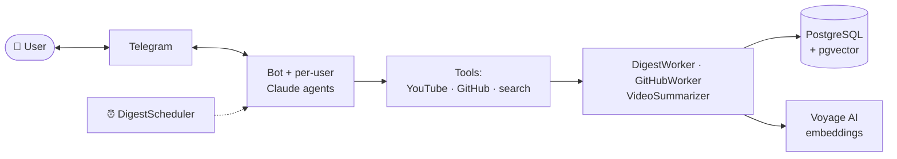

# Tech Pulse


[](https://t.me/aitechpulsebot)


[](https://codecov.io/gh/vmedvedevpro/tech-pulse)

Telegram bot for personalized tech digests powered by Claude. Tracks YouTube channels, GitHub repositories, and personal
interest topics — delivers structured summaries on demand or on a weekly schedule, and lets you semantically search
across everything you've already watched.

- 🌐 **Landing**: <https://vmedvedevpro.github.io/tech-pulse/>
- 🤖 **Try the bot**: [@aitechpulsebot](https://t.me/aitechpulsebot)

## Highlights

- **YouTube + GitHub digests** — collect new videos (with transcripts) and releases in parallel, on demand or weekly
- **Persistent video summaries** — every transcript is summarized once by Claude and reused everywhere
- **Semantic search over your history** — `search_my_videos` embeds queries with Voyage AI and runs cosine search via
  pgvector (HNSW)
- **Per-user agents** — one Claude agent per Telegram user with sliding-window memory, streaming replies, prompt
  caching, and idle-TTL eviction
- **Branded onboarding** — `/start` and `/help` are localized on the fly via a separate Claude model



Full diagram and component breakdown: [`documentation/architecture.md`](./documentation/architecture.md).

## Quickstart

```bash
uv sync                                # install
cp .env.example .env                   # fill in keys (see docs)
docker compose up -d                   # postgres + pgvector
uv run alembic upgrade head            # migrate
techpulse                              # run the bot
```

For development install extras with `uv sync --group dev` and run tests via `uv run pytest`.

## Documentation

- [Configuration](./documentation/configuration.md) — env vars and `.env` setup
- [Architecture](./documentation/architecture.md) — full diagram, components, tool table
- [Usage](./documentation/usage.md) — natural-language command examples
- [Deployment](./documentation/deployment.md) — Docker Compose, Railway, migrations
