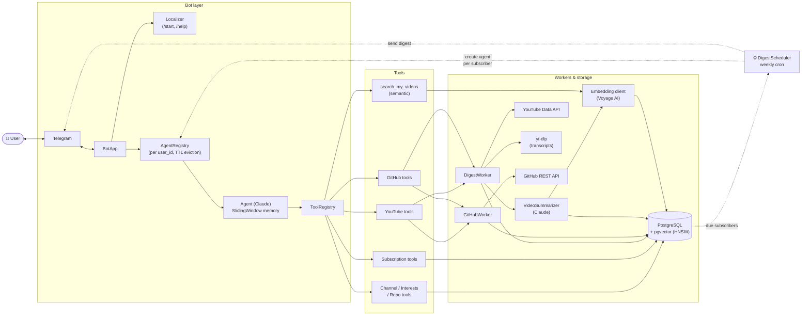

# Tech Pulse


[](https://t.me/aitechpulsebot)


[](https://codecov.io/gh/vmedvedevpro/tech-pulse)

Telegram bot for personalized tech digests powered by Claude. Tracks YouTube channels, GitHub repositories, and personal
interest topics — delivers structured summaries on demand or automatically on a weekly schedule, and lets you semantically
search across everything you've already watched.

🌐 Landing page: <https://vmedvedevpro.github.io/tech-pulse/>
🤖 Try the bot: [@aitechpulsebot](https://t.me/aitechpulsebot)

## Features

- **YouTube subscriptions** — add, remove, and list tracked YouTube channels via natural language
- **GitHub repository tracking** — watch GitHub repos and get notified about new releases
- **Interest topics** — save personal topics (e.g. "Rust", "LLM agents") to shape digest relevance
- **On-demand digest** — `/check` collects new YouTube videos (with transcripts) and new GitHub releases in parallel
- **Weekly digest scheduler** — subscribe to automatic weekly delivery; the bot runs a background cron loop and sends
  digests to all subscribers at a configured day and time
- **Deduplication** — seen videos and releases are stored in PostgreSQL and excluded from future digests
- **Video cache** — video metadata and transcripts are persisted as a standalone `videos` entity; subsequent digests
  (including for other users subscribed to the same channel) reuse cached transcripts instead of hitting yt-dlp
- **Persistent video summaries** — each new video is summarized once by a dedicated `VideoSummarizer` worker and the
  summary is stored alongside the transcript, so every later consumer reuses it
- **Semantic search over your history** — `search_my_videos` embeds the user's query with Voyage AI and runs a cosine
  similarity search over stored summary embeddings via pgvector (HNSW index), scoped to the asking user
- **On-demand repo info** — ask the agent about any GitHub repo: description, stars, language, topics
- **Per-user agents with conversation history** — each Telegram user gets a dedicated agent instance that retains
  message history across turns
- **Sliding-window memory** — old turns are trimmed once history exceeds `AGENT_MAX_TURNS` so prompts stay bounded
- **Agent eviction** — idle agents are evicted after a configurable TTL to free memory
- **Streaming responses** — agent replies are streamed to Telegram in real time via draft messages
- **Branded onboarding** — `/start` and `/help` are localized on the fly via a separate Claude model and rendered with
  custom Telegram emoji
- **Prompt caching** — system prompt is cached with `cache_control: ephemeral` to reduce token costs
- **Retry on overload** — automatically retries on Anthropic HTTP 529 with linear backoff (up to 4 attempts)
- **yt-dlp transcripts with cookie support** — transcripts are fetched via yt-dlp; an optional base64-encoded cookies
  file (`YT_COOKIES_B64`) unlocks age-gated or region-restricted videos when deployed

## Architecture



### Tools registered per agent

| Group              | Tool                                                                                 | Description                                                |
|--------------------|--------------------------------------------------------------------------------------|------------------------------------------------------------|
| YouTube data       | `resolve_channel_id`                                                                 | Resolve a channel handle to its ID                         |
|                    | `get_recent_videos`                                                                  | Fetch recent videos from a channel                         |
| YouTube transcript | `fetch_video_metadata`                                                               | Get video title and metadata                               |
|                    | `list_transcripts`                                                                   | List available transcript languages                        |
|                    | `fetch_transcript`                                                                   | Download full video transcript (yt-dlp)                    |
| Channels           | `add_channel` / `remove_channel` / `list_channels`                                   | Manage YouTube subscriptions                               |
| Interests          | `add_interest` / `remove_interest` / `list_interests`                                | Manage interest topics                                     |
| GitHub             | `get_repo_info`                                                                      | Repo description, stars, language, topics                  |
|                    | `get_latest_release`                                                                 | Latest release tag and notes                               |
| Repos              | `add_repo` / `remove_repo` / `list_repos`                                            | Manage tracked repos                                       |
| Digest             | `check_digest`                                                                       | Run DigestWorker + GitHubWorker in parallel                |
| Weekly digest      | `subscribe_weekly_digest` / `unsubscribe_weekly_digest` / `get_weekly_digest_status` | Manage automatic weekly delivery                           |
| Search             | `search_my_videos`                                                                   | Semantic search over the user's seen videos (pgvector)     |

## Requirements

- Python 3.11+
- PostgreSQL **with the `pgvector` extension** (the bundled `docker-compose.yml` uses `pgvector/pgvector:pg16`)
- API keys: Anthropic, Telegram Bot, YouTube Data API, Voyage AI (embeddings)
- GitHub token (optional, raises rate limits)
- Optional: base64-encoded YouTube cookies for yt-dlp (`YT_COOKIES_B64`)

## Installation

```bash
uv sync
```

For development:

```bash
uv sync --group dev
```

## Configuration

Create a `.env` file in the project root:

```bash
cp .env.example .env
```

| Variable                    | Description                                                       | Default                       |
|-----------------------------|-------------------------------------------------------------------|-------------------------------|
| `ANTHROPIC_API_KEY`         | Anthropic API key (required)                                      |                               |
| `ANTHROPIC_MODEL`           | Claude model for the main agent and summarizer (required)         |                               |
| `LOCALIZER_MODEL`           | Claude model used to localize `/start` and `/help`                | `claude-haiku-4-5-20251001`   |
| `TELEGRAM_BOT_TOKEN`        | Telegram bot token (required)                                     |                               |
| `YOUTUBE_API_KEY`           | YouTube Data API v3 key (required)                                |                               |
| `YOUTUBE_API_BASE_URL`      | YouTube Data API base URL                                         | `https://www.googleapis.com/youtube/v3` |
| `YT_COOKIES_B64`            | Base64-encoded cookies.txt for yt-dlp (optional)                  |                               |
| `DATABASE_URL`              | PostgreSQL connection URL (required; `postgres://` is normalized) |                               |
| `ALEMBIC_DATABASE_URL`      | Override URL used by Alembic migrations (optional)                |                               |
| `GITHUB_TOKEN`              | GitHub personal access token (optional)                           |                               |
| `LOG_LEVEL`                 | Logging level (e.g. `INFO`)                                       |                               |
| `AGENT_TTL`                 | Seconds before an idle agent is evicted                           | `1800`                        |
| `AGENT_SWEEP_INTERVAL`      | How often (seconds) the eviction loop runs                        | `300`                         |
| `AGENT_MAX_TURNS`           | Max user turns kept in agent history before sliding-window trim   | `20`                          |
| `WEEKLY_DIGEST_DOW`         | Day of week for auto-digest (0=Mon … 6=Sun)                       | `0`                           |
| `WEEKLY_DIGEST_HOUR`        | UTC hour for auto-digest delivery                                 | `9`                           |
| `DIGEST_SCHEDULER_INTERVAL` | How often (seconds) the scheduler checks for due subscribers      | `60`                          |
| `EMBEDDING_PROVIDER`        | Embedding provider (currently `voyage`)                           | `voyage`                      |
| `EMBEDDING_API_KEY`         | API key for the embedding provider (required)                     |                               |
| `EMBEDDING_MODEL`           | Embedding model name                                              | `voyage-3.5-lite`             |
| `EMBEDDING_DIMENSION`       | Embedding vector dimension (must match the pgvector column)       | `1024`                        |

## Running

1. Start PostgreSQL (the compose file pulls `pgvector/pgvector:pg16`):

```bash
docker compose up -d
```

2. Apply database migrations (creates tables, enables the `vector` extension, builds the HNSW index):

```bash
uv run alembic upgrade head
```

3. Start the bot:

```bash
techpulse
```

## Deployment

A `railway.toml` and `Dockerfile` are included for one-click deployment to Railway. The `DATABASE_URL` validator accepts
Railway's `postgres://` and `postgresql://` prefixes and rewrites them to `postgresql+asyncpg://` automatically.

## Usage

Try it: [@aitechpulsebot](https://t.me/aitechpulsebot)

Chat with the bot in Telegram using natural language:

**YouTube channels**

- `Add channel @nickchapsas`
- `Show my channels`
- `Remove @channel_handle`

**GitHub repositories**

- `Track microsoft/vscode`
- `Show my repos`
- `Stop tracking vercel/next.js`
- `What's the latest release of astral-sh/uv?`
- `Tell me about the facebook/react repo`

**Interest topics**

- `Add interest: distributed systems`
- `I'm interested in Rust`
- `Show my interests`
- `Remove interest LLM agents`

**Digest**

- `/check` — get all new YouTube videos and GitHub releases since last check
- `Check for new videos`

**Weekly digest subscription**

- `Enable weekly digest` — subscribe to automatic weekly delivery
- `Disable weekly digest` — unsubscribe
- `Am I subscribed to weekly digest?` — check subscription status

**Semantic search over your history**

- `What did I watch about Rust async runtimes?`
- `Find my videos on LLM evaluation from the last 2 weeks`
- `Remind me which video talked about pgvector indexes`

## Tests

```bash
uv run pytest
```

```bash
uv run pytest --cov=techpulse
```
