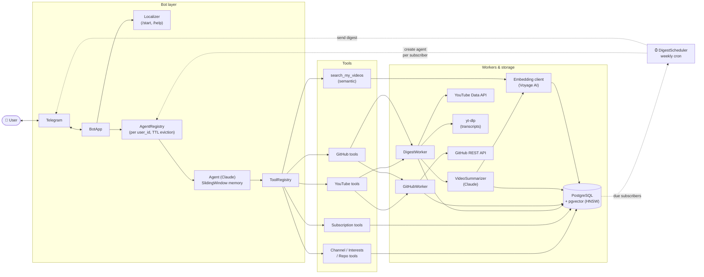

# Architecture

## Components

- **Bot layer** — `python-telegram-bot` application. The `AgentRegistry` keeps one `Agent` instance per `user_id` and
  evicts idle ones on a TTL sweep. `/start` and `/help` go through the `Localizer`, which uses a separate Claude
  model to translate the branded onboarding copy into the user's language.
- **Agent** — wraps Anthropic Messages API with prompt caching (`cache_control: ephemeral`), retries on HTTP 529
  with linear backoff, streams replies to Telegram via draft messages, and trims old turns with a sliding-window
  memory strategy bounded by `AGENT_MAX_TURNS`.
- **ToolRegistry** — declarative tool table consumed by the agent loop. See the table below.
- **Workers** — `DigestWorker` collects new YouTube videos and resolves transcripts (yt-dlp); `GitHubWorker` polls
  release feeds. `VideoSummarizer` summarizes each new transcript once with Claude and persists the result.
  Summaries are embedded with Voyage AI and stored as pgvector columns for semantic recall.
- **Storage** — PostgreSQL with the `pgvector` extension. `videos.summary_embedding` is a `Vector(1024)` column
  backed by an HNSW index (`vector_cosine_ops`).
- **DigestScheduler** — background cron loop that wakes once per `DIGEST_SCHEDULER_INTERVAL`, finds due subscribers,
  spins up agents for them via the same registry, and sends the rendered digest back through Telegram.

## Tools registered per agent

| Group              | Tool                                                                                 | Description                                            |
|--------------------|--------------------------------------------------------------------------------------|--------------------------------------------------------|
| YouTube data       | `resolve_channel_id`                                                                 | Resolve a channel handle to its ID                     |
|                    | `get_recent_videos`                                                                  | Fetch recent videos from a channel                     |
| YouTube transcript | `fetch_video_metadata`                                                               | Get video title and metadata                           |
|                    | `list_transcripts`                                                                   | List available transcript languages                    |
|                    | `fetch_transcript`                                                                   | Download full video transcript (yt-dlp)                |
| Channels           | `add_channel` / `remove_channel` / `list_channels`                                   | Manage YouTube subscriptions                           |
| Interests          | `add_interest` / `remove_interest` / `list_interests`                                | Manage interest topics                                 |
| GitHub             | `get_repo_info`                                                                      | Repo description, stars, language, topics              |
|                    | `get_latest_release`                                                                 | Latest release tag and notes                           |
| Repos              | `add_repo` / `remove_repo` / `list_repos`                                            | Manage tracked repos                                   |
| Digest             | `check_digest`                                                                       | Run DigestWorker + GitHubWorker in parallel            |
| Weekly digest      | `subscribe_weekly_digest` / `unsubscribe_weekly_digest` / `get_weekly_digest_status` | Manage automatic weekly delivery                       |
| Search             | `search_my_videos`                                                                   | Semantic search over the user's seen videos (pgvector) |
